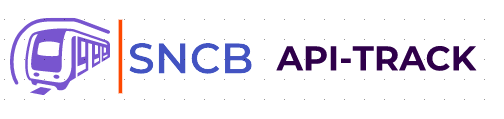
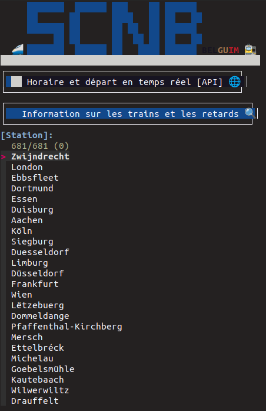
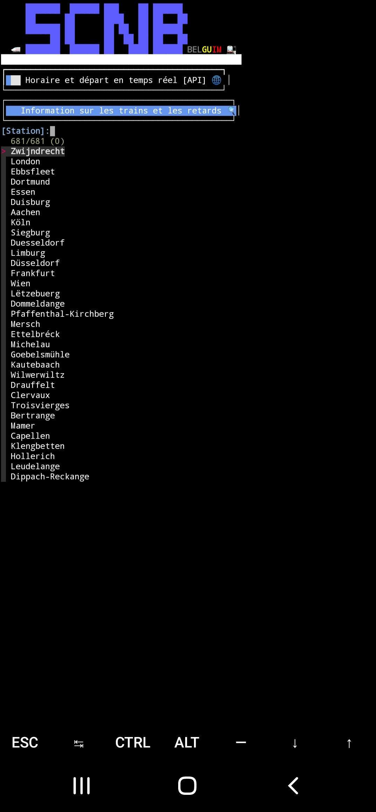

<p align="center">

</p>
<p align="center">
  
  
  
 
</p>
<p align="center">
  
  
  
</p>
<i>Marre d'être en retard pour prendre le <b>train?</b> Soyez au courant des retards avant les panneaux d'affichage et selectionné n'importe quel gare de <b>Belgique</b></i>
<p align="center">

 
</p>

**`Packages`**
  
  `toilet`
  `jq`
  `fzf`

**`Installation`**

```
$ git clone https://github.com/Lucstay11/SNCB-API-bash
```
```
$ cd SNCB-API-bash
```
```
$ chmod +x train.sh
```
**`Lance le script`**
```
$ bash train.sh
```
  
